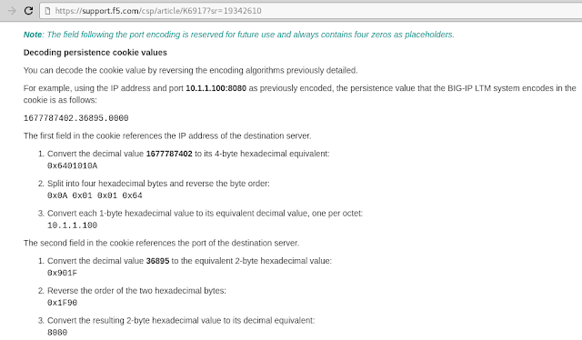
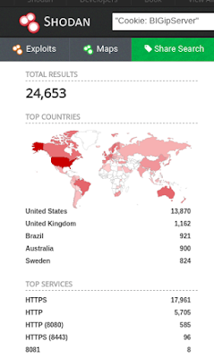
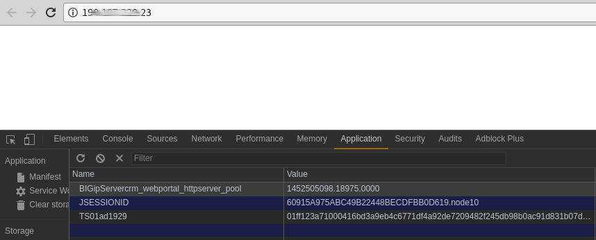

# [ F5 BIG-IP ] COOKIE REMOTE INFORMATION DISCLOSURE

Las organizaciones procuran contrarrestar las fugas de información y esto para la mayoría no es ninguna novedad. Estas fugas pueden salir de lugares totalmente insospechados

# [+] Cookie leaks:

Cookies que no nacen dentro de un aplicativo web. En cambio son seteadas por un intermediario, en nuestro caso: El balanceador de la firma F5.

El balanceador se encuentra entre el cliente y el servicio al que finalmente nos queremos conectar. 

El balanceador define para nosotros (cliente) un host  de entre un pool http/apps.
Además de determinar el camino mas optimo, a cada uno de nuestro request se le setea una cookie que al llegar a nuestro cliente trae como valor una IP y PUERTO, ofuscados, que identifica al host (que el balanceador definió para nuestro request ) desde donde llegan los recursos que nosotros  inicialmente llamamos.   

Esas cookies traen valores encodeados y existe una documentación oficial al respecto: 

https://support.f5.com/csp/article/K6917?sr=19342610.

y un articulo de OWASP que trata el tema:
https://www.owasp.org/index.php/SCG_D_BIGIP

Claramente a esta cookie el administrador podra ponerle por nombre lo que desee. Por defecto las encontramos con este formato "BIGipServer<pool http>".

Equipos para testear no nos van a faltar. 

La tool a la que le dedique un repor es muy simple, ella se conecta a la aplicación web y le pasamos el valor de las cookie para luego correr el decoder y asi  identificar la IP.

Para obtener TODAS las IP del pool es necesario hacer varias consultas y finalmente esa el la mision de la herramienta

# POC 1:

Selecciono una de las tantas aplicaciones:

Levantamos la tool: 

Segun el output de la herramienta, el pool del balanceador cuenta con solo 2 IP, que finalmente sera las unicas opciones a las que internamente seremos forwardeados.

# Quick start

	usr@pwn:~$ git clone https://github.com/ezelf/f5_cookieLeaks.git

***

### Uso:
	usr@pwn:~/$ python quickCook_v0.2.py --help
	usage: quickCook.py [-h] [-v] --host HOST [--ssl] --cookie-name COOK
	                    [--port PORT] [--req REQ] [--uri URI]

	[ F5 BIG-IP ] COOKIE REMOTE INFORMATION DISCLOSURE

	optional arguments:
	  -h, --help          show this help message and exit
	  -v, --version       show program's version number and exit
	  --host HOST         Host
	  --ssl               use ssl
	  --cookie-name COOK  Cookie Name
	  --port PORT         Port
	  --req REQ           Total Request
	  --uri URI           URI path

	[+] Demo: quickCook.py --host 192.168.1.1 --cookie-name "BIGipServerPool_X" --req 50
